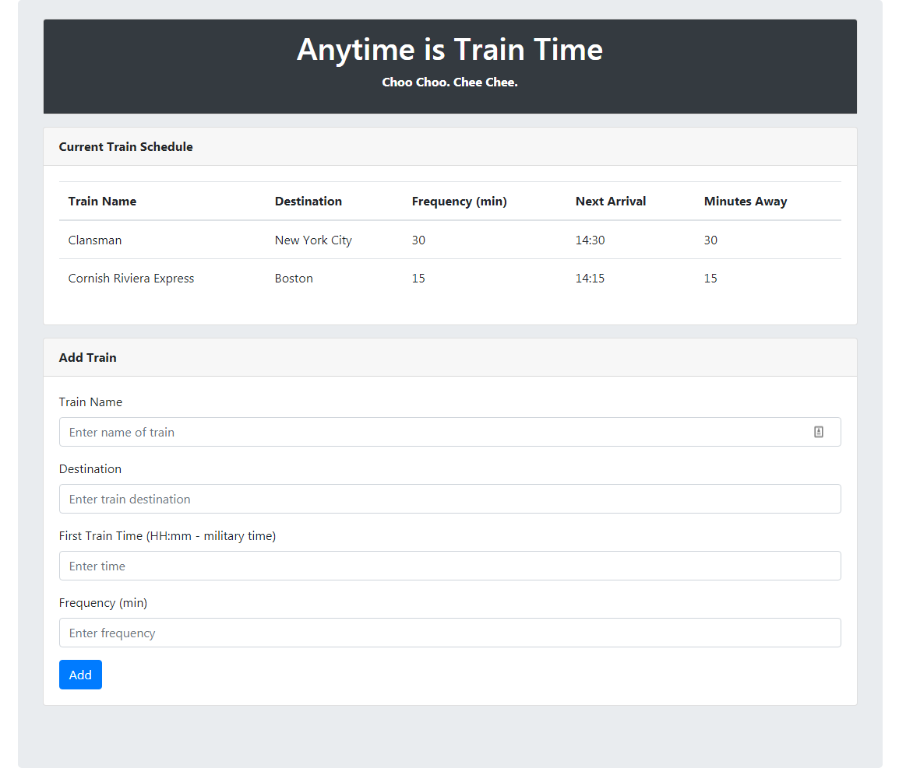

# train-scheduler

[Link to train schedule](https://chad-balash.github.io/train-scheduler/)

Web based train schedule application that incorporates Firebase to host arrival and departure data. 

## Instructions

To add a train to the schedule, enter the Train Name, Destination, First Train Time, and the Frequency of how often the train runs into the form. Click the **Add** button and your information will be added to the schedule, which will calculate the Next Arrival and how many minutes until arrival.

## Screenshots

## Built With

* html, css, javascript, jquery, ajax, bootstrap, moment, and firebase

## Authors

* **Chad Balash** - [Profile](https://github.com/chad-balash)

## Acknowledgments

* I would like to thank [xryswelter](https://github.com/xryswelter) for the help completing the calculations for the Arrival and Minutes Away variables.
